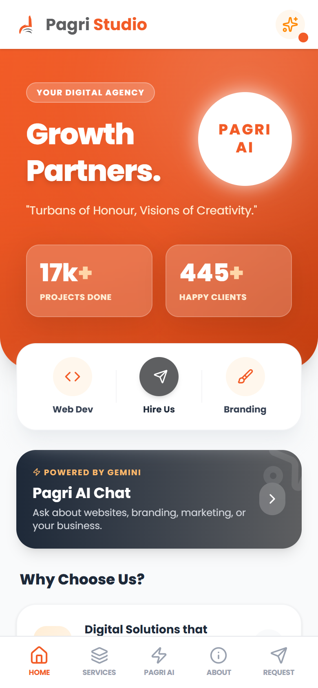
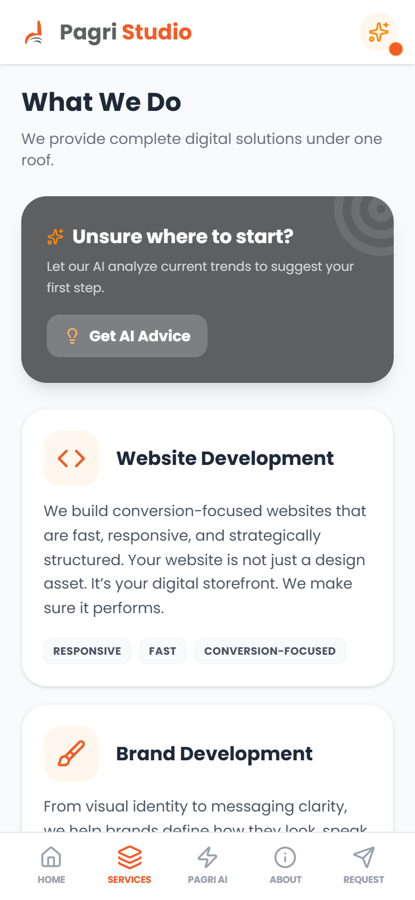
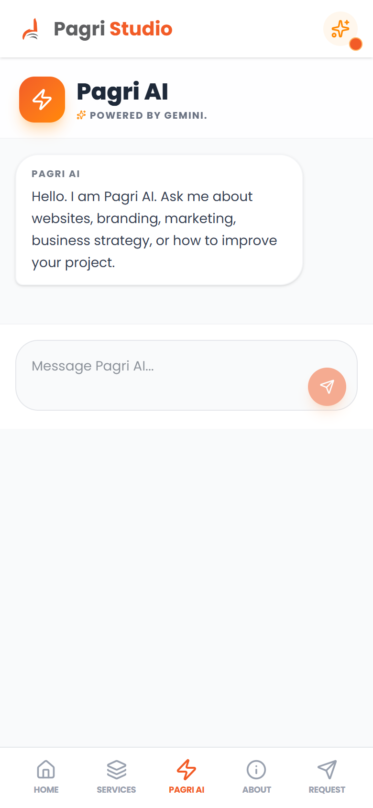
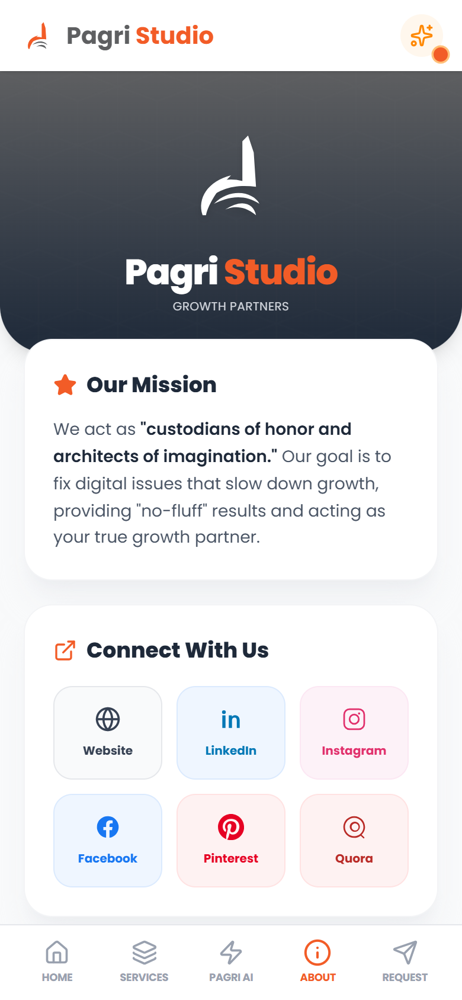
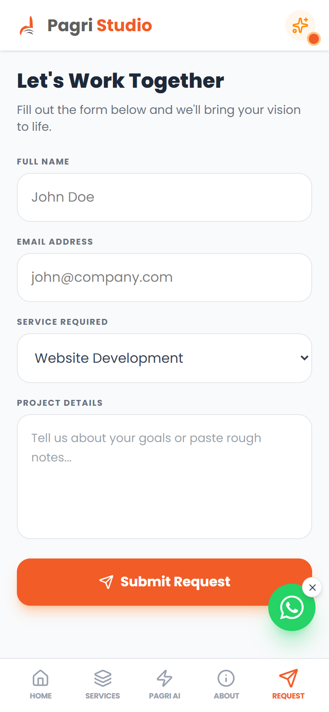
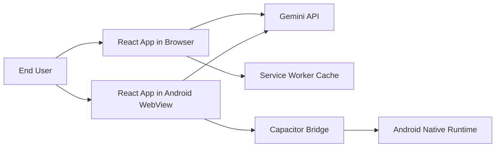
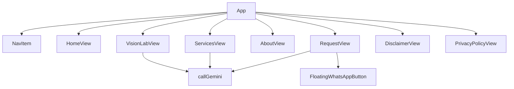
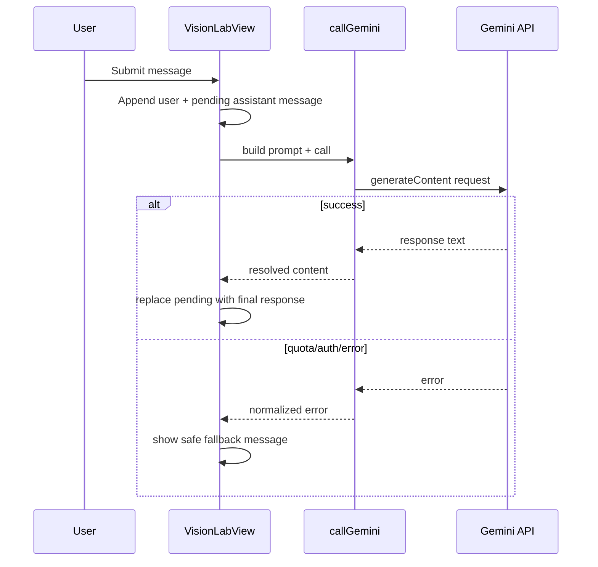

# Pagri Studio App (Technical Reviewer Edition)

Pagri Studio App is a React + Vite product surface packaged for Android using Capacitor, with embedded AI workflows (Gemini), PWA capabilities, and a mobile-first conversion funnel.

This README is intentionally technical and architecture-focused so reviewers can assess engineering maturity without exposing confidential source internals.


## Featured Screenshots

Compact mobile previews (not full-page captures):

<p align="left">
	
	
	
	
	
</p>

## 1. Executive Summary

Problem addressed:

- Build a single-codebase app that combines digital agency positioning, lead capture, and AI-assisted consultation in a deployable web + Android form.

Engineering objectives:

- Keep delivery velocity high with a lean frontend stack
- Ship app-shell UX optimized for narrow-screen devices
- Support offline-tolerant behavior via service worker cache
- Integrate AI safely with retry and error fallback logic
- Keep legal/compliance content first-class in product UX

Current state:

- Production-capable frontend + Android wrapper
- Working AI interactions for chat and brief optimization
- Built-in legal policy pages and social/contact routing
- No backend persistence layer yet (intentional current scope)

## 2. System Context



Operationally, the same React build is consumed by:

- Browser runtime (PWA-capable)
- Android WebView runtime via Capacitor

## 3. High-Level Architecture

The frontend follows a single-app-shell pattern with tab-level view switching.

### 3.1 Runtime Layers

1. Presentation Layer
- Header, bottom nav, content container
- View rendering by active tab state

2. Domain/UI Feature Layer
- HomeView
- ServicesView
- VisionLabView (AI chat)
- AboutView
- RequestView
- Legal views (Disclaimer, Privacy)

3. Integration Layer
- Gemini REST interaction utility
- Service worker registration/cleanup logic
- Capacitor back-button and app-exit behavior

### 3.2 Component Topology (Conceptual)



## 4. Core Engineering Flows

### 4.1 Tab Navigation and Mobile UX

- `activeTab` state controls view selection
- Central scrolling region resets on tab change
- Bottom nav remains fixed for predictable reachability
- Safe-area handling included for device insets

### 4.2 Android Hardware Back Behavior

Back flow logic is intentionally explicit:

1. If in legal pages, return to About
2. Else if not on Home, return to Home
3. Else prompt user and optionally call app exit

This prevents accidental app exits and preserves user orientation.

### 4.3 AI Chat Request Lifecycle



### 4.4 AI Reliability Strategy

Implemented protections include:

- Retry loop with exponential backoff for transient issues
- Explicit handling for 429 with retry-delay extraction
- Explicit handling for 401/403 (invalid key/permissions)
- Sanitized fallback messages in UI

## 5. Security and Data Posture

### 5.1 Current Posture

- Gemini API key is consumed from frontend environment variable (`VITE_GEMINI_API_KEY`)
- Sensitive key is not required in source for functionality, but frontend keys are inherently exposable at runtime

### 5.2 Reviewer Notes

For stronger production security, migrate AI calls behind a backend proxy that provides:

- Server-side key custody
- Per-user/IP throttling
- Input/output moderation policies
- Structured logging and abuse monitoring

### 5.3 Privacy Surface

- App includes in-product Privacy Policy and Disclaimer pages
- Current form flow is UI-state only (no server persistence by default)

## 6. PWA and Caching Model

### 6.1 Current Service Worker Behavior

- App shell pre-caches core assets
- Fetch strategy: `cache-first` then network then `/` fallback
- Cache name versioning controls invalidation

### 6.2 Operational Risks

- Broad runtime caching can retain stale resources if cache versioning is not managed carefully
- Reviewers should validate update rollout behavior after each release

## 7. Repository and Build Surfaces

Important directories/files:

- `src/` - React feature implementation
- `public/manifest.webmanifest` - install metadata
- `public/sw.js` - service worker
- `capacitor.config.json` - app id/name + web output target
- `android/` - native Android project
- `vite.config.js` - bundler + plugin wiring
- `eslint.config.js` - lint and ignore strategy

## 8. Tech Stack

Application:

- React 19
- Vite 8
- Tailwind CSS 4
- Lucide React
- @fontsource/poppins

Native packaging:

- @capacitor/core
- @capacitor/android
- @capacitor/app

Quality/tooling:

- ESLint 9 + react-hooks + react-refresh

AI:

- Gemini `gemini-2.5-flash`

## 9. Setup and Execution

Prerequisites:

- Node.js 20+
- npm 10+
- Android Studio + JDK (for native packaging)

Install + run dev:

```bash
npm install
npm run dev
```

Build + preview:

```bash
npm run build
npm run preview
```

Lint:

```bash
npm run lint
```

Android sync/open:

```bash
npm run build
npx cap sync android
npx cap open android
```

Environment variable (`.env.local`):

```bash
VITE_GEMINI_API_KEY=your_real_key_here
```

## 10. Product Lifecycle (Start to End)

### Phase 1: Discovery

- Identified dual objective: brand storytelling + lead conversion
- Defined AI assistant as product differentiator

### Phase 2: Foundation

- Bootstrapped React/Vite app
- Integrated Tailwind and typography
- Added lint baseline and build scripts

### Phase 3: UX Framework

- Built mobile app-shell with persistent bottom navigation
- Implemented tab-level content modules

### Phase 4: AI Integration

- Added chat experience with context-aware prompt construction
- Added AI assist for service recommendation and brief rewrite
- Added quota/auth failure handling

### Phase 5: Conversion Layer

- Implemented request form and success state
- Added direct WhatsApp engagement mechanism

### Phase 6: Compliance and Trust

- Added legal policy pages and navigation hooks

### Phase 7: Distribution

- Added PWA manifest + service worker
- Added Android packaging and runtime back-button behavior

### Phase 8: Operational Continuity

- Dependency updates, policy maintenance, conversion tuning, and planned backend hardening

## 11. Current Limitations

- Single large UI module currently trades architectural purity for delivery speed
- No server-side lead persistence/CRM integration yet
- Frontend AI key model is acceptable for prototype/pilot, not ideal for hardened production
- Automated test suite is not yet implemented

## 12. Recommended Engineering Roadmap

1. Split UI into feature folders (`features/home`, `features/ai`, `features/request`, etc.)
2. Introduce backend gateway for AI and lead submission
3. Add schema validation for user inputs and outbound payloads
4. Add observability (analytics, error tracing, API latency/429 telemetry)
5. Add tests:
	 - Unit tests for retry/error helpers
	 - Integration tests for key flows
	 - E2E smoke tests for tab navigation + request funnel
6. Add CI checks for lint/build/test + release artifacts

## 13. Confidentiality Statement

This project is confidential/proprietary.

- Public source disclosure is restricted
- This document intentionally explains architecture, engineering decisions, and lifecycle without exposing protected implementation details beyond what is necessary for technical review

## 14. License

All rights reserved. Unauthorized redistribution or publication of proprietary implementation details is prohibited without explicit owner permission.

## 15. Contact

- Organization: Pagri Studio
- Email: contact@pagristudio.com
